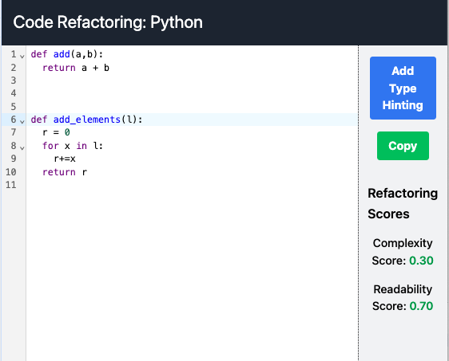
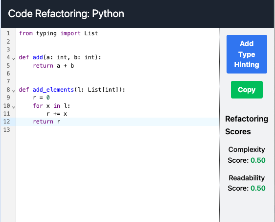

## Type Hinting

## Type Hinting

Trying to build a fast python type hinting generation tool, using LLMs

Taking ~2seconds per file, but can probably lower that down by a bunch, I got some ideas.

Before - After:

 
